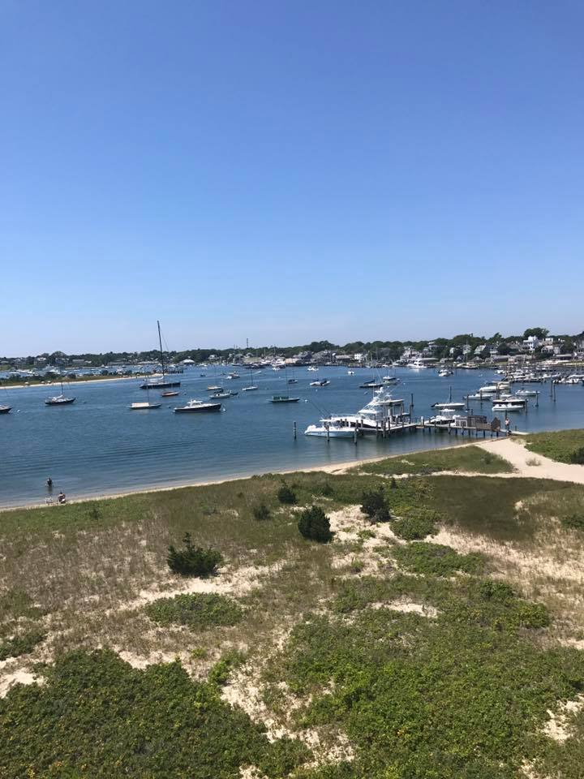

```{r setup, include=FALSE}
knitr::opts_chunk$set(echo = TRUE)
```

Hello! On this page you can explore things that I like to do for fun, and see a little bit about me.


```{r echo = FALSE, fig.cap = "Cape Cod"}
knitr:: 
```


